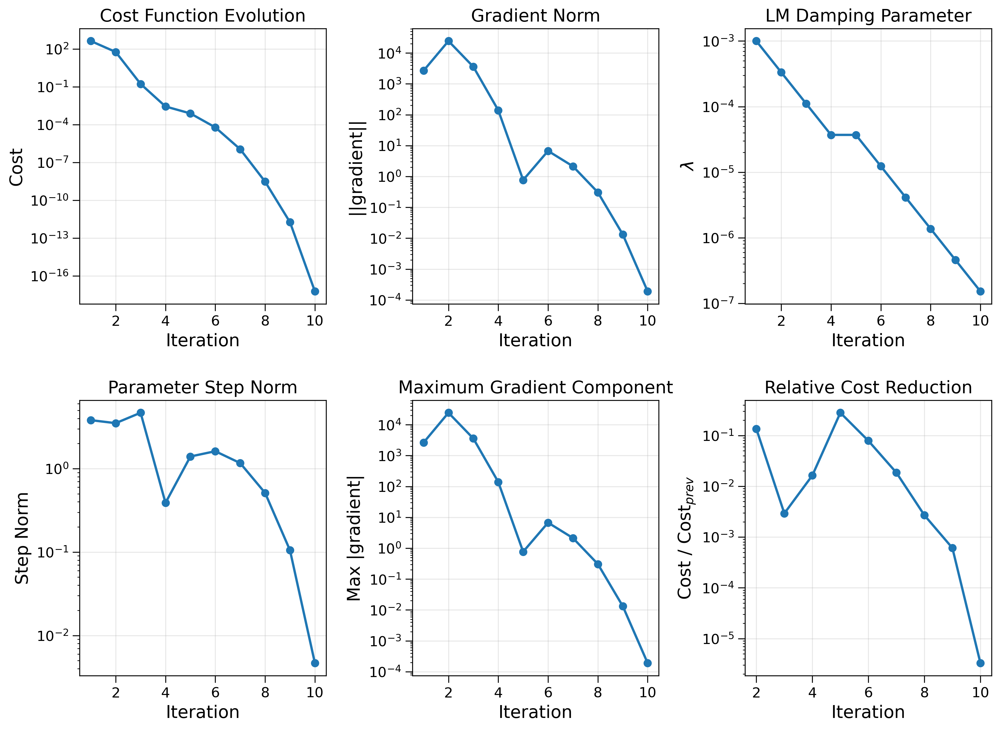
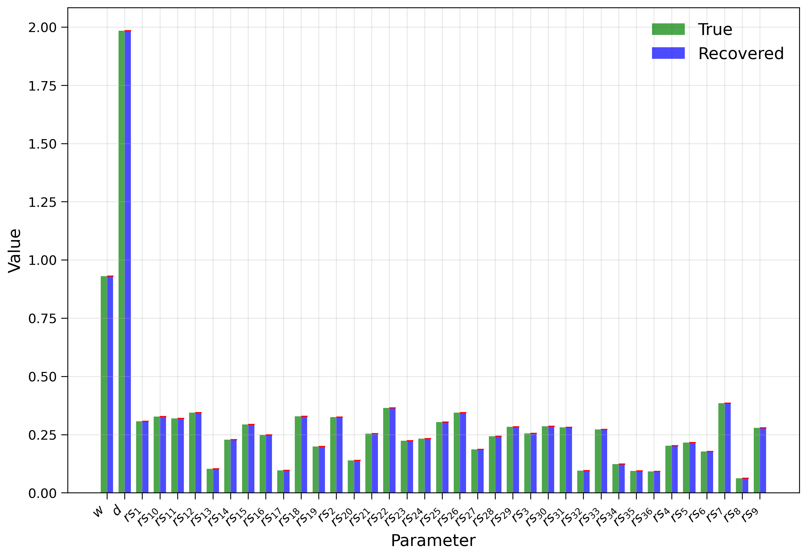
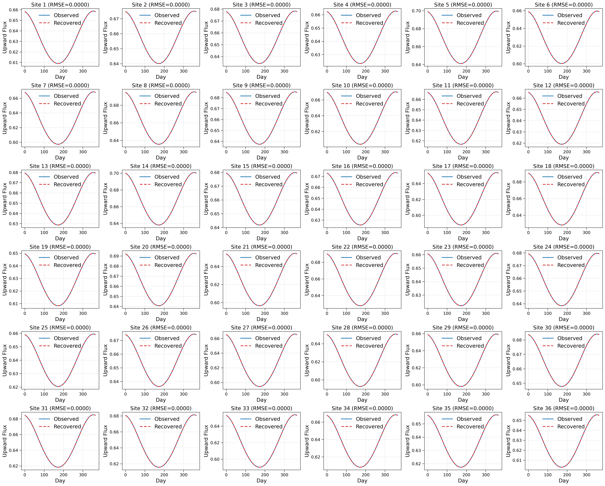

# Calibration of two-Stream radiation transfer using adjoint model

This example demonstrates the calibration of canopy optical properties and per-site surface reflectance using an adjoint model. The calibration estimates:

- `w`: **single-scattering albedo**, describing the fraction of radiation that is scattered rather than absorbed.
- `d`: **preferred directional scattering parameter**, describing the directional preference of the scattering process.
- `rs`: **psurface reflectance**, representing the reflectivity of the underlying surface.

We use a multisite calibration framework based on a multilevel two-stream radiation transfer model and adjoint-based the **Levenberg–Marquardt (LM)** optimization algorithm. The Fortran program generates **synthetic references** using randomly generated parameters and then attempts to recover **w**, **d**, and all **rs(site)** values. The optimization process has the following features:

- **Multisite parameter calibration**: Simultaneously estimates shared **w** and **d** along with per-site **rs** (total parameters: $N_{\rm sites}$ + 2)
- **Full-year time series**: Uses 365 daily references per site to capture seasonal variability
- **Synthetic reference generation**: Generates references using randomly generated parameters
- **Tapenade adjoint differentiation**: Uses `multilevel_matrix_b` to compute the Jacobian rows
- **Gauss-Newton Hessian**: Constructs the approximate Hessian from the Jacobian
- **LM optimization**: Uses adaptive damping for robust parameter estimation
- **Backtracking line search**: Reduces the parameter step when the trial solution does not decrease the cost
- **Adaptive damping**: Updates the LM damping parameter $\lambda$ using the gain ratio $\rho$
- **Multiple convergence criteria**: Checks cost, gradient norm, parameter step size, and parameter recovery

## Algorithm

The calibration minimizes the multisite objective function:

$$J(p) = \frac{1}{2} \sum_{i=1}^{N_{\rm{sites}}} \sum_{j=1}^{365} \left[ f_{\rm{up},i,j}(p) - f_{\rm{ref},i,j} \right]^2$$

where the parameter vector is:

$$p = \begin{bmatrix} w \\ d \\ rs_1 \\ rs_2 \\ \vdots \\ rs_{N_{\rm{sites}}} \end{bmatrix}$$

and $i$ indexes sites and $j$ indexes days.

The Jacobian is:

$$J(p) = \begin{bmatrix}
\frac{\partial f_{\rm{up},1,1}}{\partial w} & \frac{\partial f_{\rm{up},1,1}}{\partial d} & \frac{\partial f_{\rm{up},1,1}}{\partial rs_1} & \cdots & \frac{\partial f_{\rm{up},1,1}}{\partial rs_{N_{\rm{sites}}}} \\
\frac{\partial f_{\rm{up},1,2}}{\partial w} & \frac{\partial f_{\rm{up},1,2}}{\partial d} & \frac{\partial f_{\rm{up},1,2}}{\partial rs_1} & \cdots & \frac{\partial f_{\rm{up},1,2}}{\partial rs_{N_{\rm{sites}}}} \\
\vdots & \vdots & \vdots & \ddots & \vdots \\
\frac{\partial f_{\rm{up},N_{\rm{sites}},365}}{\partial w} & \frac{\partial f_{\rm{up},N_{\rm{sites}},365}}{\partial d} & \frac{\partial f_{\rm{up},N_{\rm{sites}},365}}{\partial rs_1} & \cdots & \frac{\partial f_{\rm{up},N_{\rm{sites}},365}}{\partial rs_{N_{\rm{sites}}}}
\end{bmatrix}$$

The Gauss-Newton Hessian approximation is:

$$H = J^T J$$

The LM parameter update solves:

$$(H + \lambda I) \Delta p = -\nabla J$$

where:

$$\Delta p = \begin{bmatrix} \Delta w \\ \Delta d \\ \Delta rs_1 \\ \vdots \\ \Delta rs_{N_{\rm{sites}}} \end{bmatrix}$$

The damping parameter $\lambda$ is dynamically adjusted using the ratio between the actual and predicted cost reduction.

## Convergence Criteria

The optimization uses several convergence tests:

- **Gradient tolerance**: $\|\nabla J\| < \rm{gradient\_tolerance}$ (adaptive, based on initial gradient)
- **Parameter-step tolerance**: $\|\Delta p\| < 1.0 \times 10^{-10} (1 + \|p\|)$
- **Cost tolerance**: $J < 1.0 \times 10^{-16}$
- **Maximum iterations**: 200

## Jacobian Computation via Adjoint

The Jacobian rows are computed using the adjoint model by seeding `fupb(nlevels_tot) = 1.0`:

$$\rm{row\_grad} = \begin{bmatrix} w_b & d_b & rs_{b,1} & \cdots & rs_{b,N_{\rm{sites}}} \end{bmatrix}$$

where `wb`, `db`, and `rsb` are the adjoint variables returned by `multilevel_matrix_b`.

The full Jacobian is then assembled by looping over all sites and days:

1. For each (site, day), compute the raw sensitivity row
2. Compute the residual $r = f_{\rm{up}} - f_{\rm{obs}}$
3. Accumulate: $\nabla J = \nabla J + r \cdot \rm{row\_{grad}}$
4. Accumulate: $H = H + \rm{row\_{grad}}^T \cdot \rm{row\_{grad}}$

## Identifiability Diagnostics

The LM algorithm automatically handles parameter correlations through the damping term $\lambda I$. The gain ratio $\rho$ indicates the quality of the quadratic model:

$$\rho = \frac{\rm{actual reduction}}{\rm{predicted reduction}}$$

- $\rho > 0.75$: Good agreement, decrease $\lambda$
- $\rho < 0.25$: Poor agreement, increase $\lambda$
- $\rho \in [0.25, 0.75]$: Keep $\lambda$ unchanged

## Configurable Number of Sites

The number of sites can be configured at compile time using the `N_SITES` variable:

```bash
# Build with M sites
make N_SITES=M
```

## Total Parameters

The total number of calibrated parameters is:

$$
N_{\rm{params}} = N_{\rm{sites}} + 2
$$

where $N_{\rm{sites}}$ is configurable.

## Tapenade Integration

The Tapenade path needs to be adjusted in the Makefile using:

```makefile
TAPENADE_HOME = /path/to/tapenade
```

The Tapenade runtime is expected at:

```makefile
$(TAPENADE_HOME)/ADFirstAidKit
```

The adjoint model is generated by Tapenade from the forward model `multilevel_matrix`. The adjoint routine `multilevel_matrix_b` computes the derivatives with respect to `w`, `d`, and `rs` for each `(site, day)`.

## Requirements

- NVIDIA HPC SDK or a compatible compiler supporting the configured Fortran flags
- Tapenade 3.16 when using Tapenade-generated differentiation files
- C compiler for the Tapenade runtime
- Python packages:
  - `numpy`
  - `matplotlib`
  - `mpltex`
  - `fgpt`

## Build

Compile the project with:

```bash
# Build with 8 sites (default)
make

# Build with M sites
make N_SITES=M
```

This produces the executable:

```text
calibrate
```

The build creates the following directories:

```text
obj/
mod/
```

`obj/` contains compiled object files and `mod/` contains Fortran module files.

## Run

Run the calibration with:

```bash
make run N_SITES=M
```

or directly:

```bash
./calibrate
```

The program generates a new synthetic calibration problem for each execution.

## Run and Visualize

To build, execute the calibration, and generate the plots:

```bash
make viz N_SITES=M
```

This performs:

1. Compilation of the Fortran sources
2. Execution of the calibration
3. Generation of `w_d_rs_true.txt`
4. Generation of `w_d_rs_optimization_history.txt`
5. Generation of `w_d_rs_recovered.txt`
6. Generation of `w_d_rs_flux_comparison.txt`
7. Execution of `plots.py`
8. Generation of:
   - `optimization_history.png`
   - `parameters_summary.png`
   - `flux_comparison.png`

## Visualization Only

If the optimization output files already exist, generate the plots with:

```bash
make plot N_SITES=M
```

or:

```bash
python plots.py --n_sites M
```

## Output Files

### w_d_rs_true.txt

Contains the randomly generated reference parameters:

```text
True_w = ...
True_d = ...
True_rs(1) = ...
True_rs(2) = ...
...
```

### w_d_rs_optimization_history.txt

Contains the optimization history. The columns are:

| Column | Description |
|---|---|
| `iter` | Iteration number |
| `cost` | Current cost function value |
| `grad_norm` | Norm of the gradient vector |
| `lambda_lm` | LM damping parameter |
| `step_norm` | Norm of the parameter update step |
| `max_gradient` | Maximum absolute gradient component |

### w_d_rs_recovered.txt

Contains the recovered parameters with true values and errors:

```text
Recovered w, d, rs(site)

w : recovered true error
d : recovered true error
rs(1) : recovered true error
rs(2) : recovered true error
...
```

### w_d_rs_flux_comparison.txt

Contains the flux comparison for all sites and days:

```text
Final flux comparison

Columns: site day Fup_model Fup_obs residual

1 1 0.3456789012 0.3456789012 0.1234567890E-12
1 2 0.3456789013 0.3456789013 0.2345678901E-12
...
```

## Diagnostic Plots

### optimization_history.png

The figure contains six diagnostic panels:

1. **Cost Function Evolution:** Shows the decrease of the objective function.
2. **Gradient Norm:** Shows the convergence of the gradient to zero.
3. **LM Damping Parameter:** Shows the adaptation of $\lambda$.
4. **Parameter Step Norm:** Shows the size of parameter updates.
5. **Maximum Gradient Component:** Shows the largest gradient component.
6. **Relative Cost Reduction:** Shows the cost reduction ratio between iterations.

<p align="center">
  
</p>

### parameters_summary.png

Compares true vs. recovered parameters for:

- `w` (single-scattering albedo)
- `d` (shape parameter)
- `rs(1)`, `rs(2)`, ..., `rs(N_sites)` (surface reflectance per site)

<p align="center">
  
</p>

### flux_comparison.png

The figure compares observed vs. recovered upward fluxes over the full year (365 days) for each site.

Each subplot shows:

- **Observed flux:** Synthetic references from true parameters
- **Recovered flux:** Computed using recovered parameters
- **RMSE:** Reported in the title

This plot validates that the recovered parameters reproduce the reference flux across the entire seasonal cycle.

<p align="center">
  
</p>
