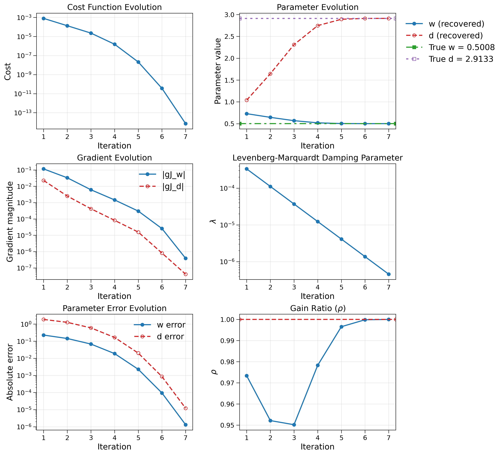

# Calibration of two-stream radiation transfer solver

This example demonstrates the calibration of two parameters in a two-stream radiation transfer solver:

- `w`: **single-scattering albedo**, describing the fraction of radiation that is scattered rather than absorbed.
- `d`: **preferred directional scattering parameter**, describing the directional preference of the scattering process.

We use a two-site parameter calibration framework based on a multilevel forward model and the **Levenberg–Marquardt (LM)** optimization algorithm. The Fortran program generates synthetic references using randomly generated parameters and then attempts to recover the parameters `w` and `d` at two independent sites. The Python script reads the optimization history and generates diagnostic plots. The optimization process has the following features:

- **Two-site parameter calibration**: Simultaneously estimates `w` and `d` using references from two independent sites
- **Synthetic reference generation**: Generates references using randomly parameters
- **Tapenade tangent differentiation**: Uses `multilevel_matrix_d` to calculate derivatives with respect to `w` and `d`
- **Gauss–Newton Hessian**: Constructs the approximate Hessian from the Jacobian
- **Levenberg–Marquardt optimization**: Uses adaptive damping for robust parameter estimation
- **Backtracking line search**: Reduces the parameter step when the trial solution does not decrease the cost
- **Adaptive damping**: Updates the LM damping parameter $\lambda$ using the gain ratio $\rho$
- **Parameter identifiability diagnostic**: Computes the correlation between the Jacobian columns
- **Multiple convergence criteria**: Checks cost, gradient norm, parameter step size, and reference-parameter recovery

## Algorithm

The calibration minimizes the two-site objective function:

$$
J(w,d) = \frac{1}{2}\left(r_1^2 + r_2^2\right)
$$

where:

$$
r_1 = f_{\mathrm{up},1} - f_{\mathrm{ref},1}
$$

$$
r_2 = f_{\mathrm{up},2} - f_{\mathrm{ref},2}
$$

The Jacobian is:

$$
J(w,d) =
\begin{bmatrix}
\dfrac{\partial f_{\mathrm{up},1}}{\partial w} &
\dfrac{\partial f_{\mathrm{up},1}}{\partial d} \\
\dfrac{\partial f_{\mathrm{up},2}}{\partial w} &
\dfrac{\partial f_{\mathrm{up},2}}{\partial d}
\end{bmatrix}
$$

The Gauss–Newton Hessian approximation is:

$$
H = J^{\mathsf{T}}J
$$

The LM parameter update solves:

$$
(H + \lambda I)\,\Delta p = -\nabla J
$$

where:

$$
\Delta p =
\begin{bmatrix}
\Delta w \\
\Delta d
\end{bmatrix}
$$

The damping parameter $\lambda$ is dynamically adjusted using the ratio between the actual and predicted cost reduction.

## Convergence criteria

The optimization uses several convergence tests:

- **Cost tolerance**: $\mathrm{cost} < 1.0\times10^{-14}$
- **Gradient tolerance**: $\lVert \nabla J \rVert < 1.0\times10^{-10}$
- **Parameter-step tolerance**: $\lVert \Delta p \rVert < 1.0\times10^{-9}\left(1+\lVert p\rVert\right)$
- **True-parameter recovery**:
    - $|w - w_{\mathrm{ref}}| < 1.0\times10^{-6}$
    - $|d - d_{\mathrm{ref}}| < 1.0\times10^{-6}$
- **Maximum iterations**: `200`

## Identifiability diagnostic

The code computes the correlation between the two Jacobian columns:

$\mathrm{jac\_corr}=\frac{h_{wd}}{\sqrt{h_{ww}\,h_{dd}}}$

Values close to `+1` or `-1` indicate that the effects of `w` and `d` are strongly correlated and that the two parameters may be poorly identifiable. A warning is issued when:

$\left|\mathrm{jac\_corr}\right| > 0.999$

## Tapenade integration

The Tapenade path need to be adjusted in the Makefile using:

    TAPENADE_HOME = /path/to/tapenade

The Tapenade runtime is expected at:

    $(TAPENADE_HOME)/ADFirstAidKit

## Requirements

1. NVIDIA HPC SDK or a compatible compiler supporting the configured Fortran flags
2. Tapenade 3.16 when using Tapenade-generated differentiation files
3. C compiler for the Tapenade runtime
4. Python packages:
   - `numpy`
   - `matplotlib`
   - `mpltex`
   - `fgpt`

## Build

Compile the project with:

    make

This produces the executable:

    calibrate

The build creates the following directories:

    obj/
    mod/

`obj/` contains compiled object files and `mod/` contains Fortran module files.

## Run

Run the calibration with:

    make run

or directly:

    ./calibrate

The program generates a new synthetic calibration problem for each execution.

The random seed is initialized using `/dev/urandom`, so the reference parameters and site properties generally differ between runs.

## Run and Visualize

To build, execute the calibration, and generate the plots:

    make viz

This performs:

1. Compilation of the Fortran sources
2. Execution of the calibration
3. Generation of `true_parameters.txt`
4. Generation of `optimization_history.txt`
5. Execution of `plots.py`
6. Generation of `optimization_history.png`

## Visualization Only

If the optimization output files already exist, generate the plots with:

    make plot

or:

    python3 plots.py

## Output Files

### `true_parameters.txt`

Contains the randomly generated reference parameters:

    True_w = ...
    True_d = ...

### `optimization_history.txt`

Contains the optimization history. The columns are:

    iter cost w d gJ_w gJ_d lambda rho

### `optimization_history.png`

Generated by `plots.py`. The figure contains six diagnostic panels:

1. **Cost Function Evolution**
2. **Parameter Evolution**
3. **Gradient Evolution**
4. **Levenberg–Marquardt Damping Parameter ($\lambda$)**
5. **Parameter Error Evolution**
6. **LM Gain Ratio ($\rho$)**

  

