Benchmark
=========

The pipeline was benchmarked to verify that the transpiled code produces
results consistent with the original Fortran implementation. Since each
procedure is isolated during the transpilation process, its inputs and
corresponding outputs can be generated independently, allowing the
correctness of the transpiled implementation to be validated against the
original Fortran code.

The same validation strategy is then applied to the JAX transformation.
Rather than comparing the JAX implementation against the intermediate
Python version, its outputs are compared directly with those produced by
the original Fortran implementation. This ensures that correctness is
always measured against the reference implementation.

During the isolation and transpilation stages, every transformed
procedure is compiled (for Fortran) and executed (for Python) to verify
that the generated outputs remain consistent throughout the
transformation pipeline.

To compare the outputs, we use ``numpy.isclose`` for scalar and Boolean
values and ``numpy.allclose`` for arrays.

The default tolerances used by ``numpy.allclose`` are sufficient for our
validation:

- Relative tolerance (``rtol``): ``1e-5``
- Absolute tolerance (``atol``): ``1e-8``

The same tolerances are used for scalar comparisons with
``numpy.isclose``. Since the original Fortran code primarily operates on
64-bit floating-point (``REAL(KIND=8)`` / ``float64``) values, these
tolerances are sufficiently strict to detect meaningful numerical
differences while accounting for the small rounding errors inherent to
floating-point arithmetic.

Both ``numpy.allclose`` and ``numpy.isclose`` determine whether two
values satisfy the following condition:

.. math::

   |a - b| \leq \mathrm{atol} + \mathrm{rtol} \times |b|

where:

- ``a`` is the value produced by the transpiled implementation.
- ``b`` is the reference value produced by the original Fortran
  implementation.
- ``atol`` is the absolute tolerance.
- ``rtol`` is the relative tolerance.

This validation strategy ensures that both the Python and JAX
implementations faithfully reproduce the numerical behavior of the
original Fortran code.

All of the following benchmarks were run on the CPU.

Performance Comparison Between Python and Fortran
-------------------------------------------------

This section compares the execution performance of the original Fortran
implementation with the transpiled Python version. The benchmarks measure
both the runtime and the speedup introduced by the
transpilation process while confirming that numerical correctness is
preserved. Unless otherwise stated, all benchmarks are performed using
the inputs generated during the isolation phase.

The evaluation was conducted using a representative scientific workflow
from ORCHIDEE. Specifically, the ``hydrol_main`` component was selected
to assess the robustness, scalability, and completeness of the
transpilation pipeline. The module consists of the following procedures:

.. code-block:: text

    hydrol_main/
    ├── hydrol_soil
    ├── hydrol_vegupd
    ├── hydrol_alma
    ├── hydrol_canop
    ├── explicitsnow_main
    └── hydrol_hydraulic_arch_tuzet_calc

Several of these procedures also invoke additional child procedures,
which are likewise isolated and transpiled. Consequently, the current
version of the project is capable of transforming the complete
``hydrol_main`` workflow from Fortran to both Python and JAX.

These procedures exercise a wide variety of Fortran language features,
including multidimensional arrays, conditional logic, loops, intrinsic
functions, and nested procedure calls. Successfully transpiling the
entire workflow therefore provides a representative assessment of the
pipeline's ability to preserve both numerical correctness and execution
semantics across complex scientific codes.

The speedup of Python relative to Fortran is calculated as:

.. math::

    speedup = \frac{T_{fortran}}{T_{python}}

where :math:`T_{fortran}` and :math:`T_{python}` are the measured
wall-clock execution times of the Fortran and Python implementations,
respectively.

Performance Comparison: Python Speed-up vs. Fortran Runtime
~~~~~~~~~~~~~~~~~~~~~~~~~~~~~~~~~~~~~~~~~~~~~~~~~~~~~~~~~~~

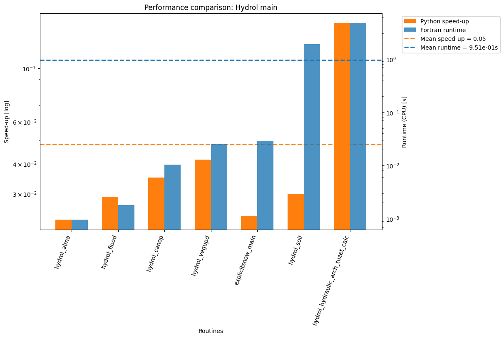

   **Figure 4:** Comparison of the execution time of each transpiled
   ``hydrol_main`` procedure with its original Fortran implementation.
   The figure reports both the execution time of the original Fortran
   implementation and the relative slowdown (or speed-up, where
   applicable) of the transpiled Python version.

The following figures present the performance results for the child
procedures of ``hydrol_main``:

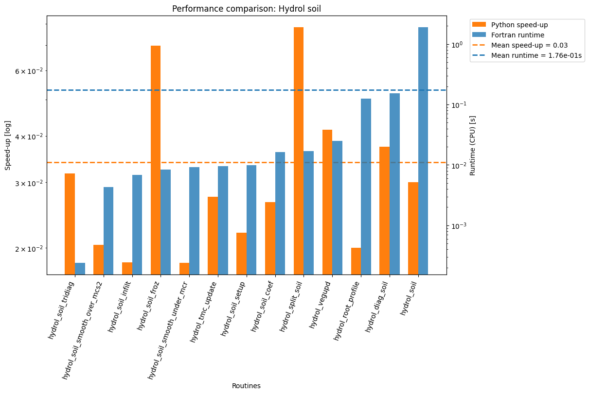

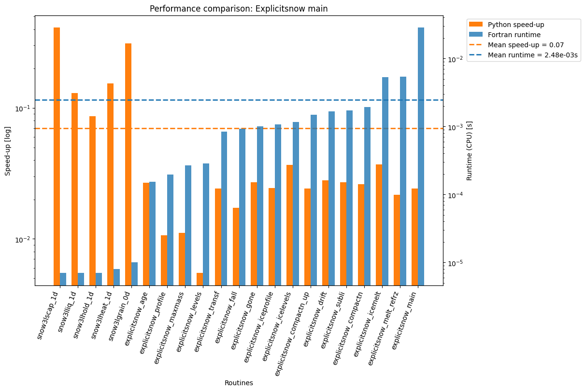

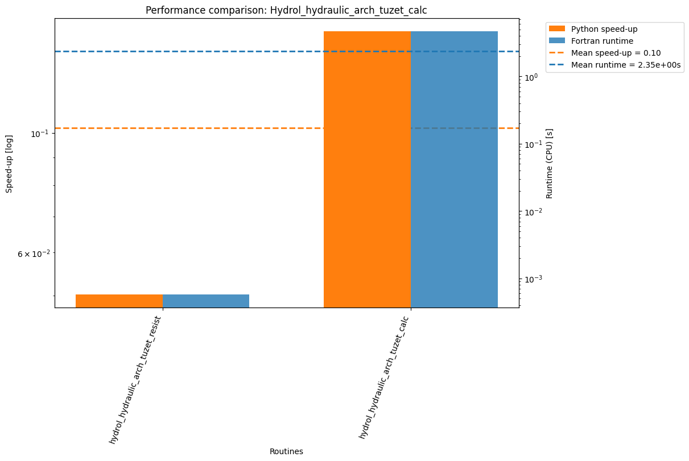

As expected, the transpiled Python implementation is generally slower
than the original Fortran code. This performance difference is primarily
explained by the fact that Fortran is a compiled language whose
optimizing compilers generate highly efficient machine code, whereas the
transpiled implementation executes through the Python interpreter and
relies on NumPy operations. Consequently, Python introduces additional
interpreter overhead and incurs extra costs associated with function
calls and object management.

Beyond runtime performance, the numerical correctness of the transpiled
implementation was evaluated by computing the maximum absolute
difference between the values produced by the Fortran and Python
implementations for every variable in each isolated procedure. The
following figures summarize these results.

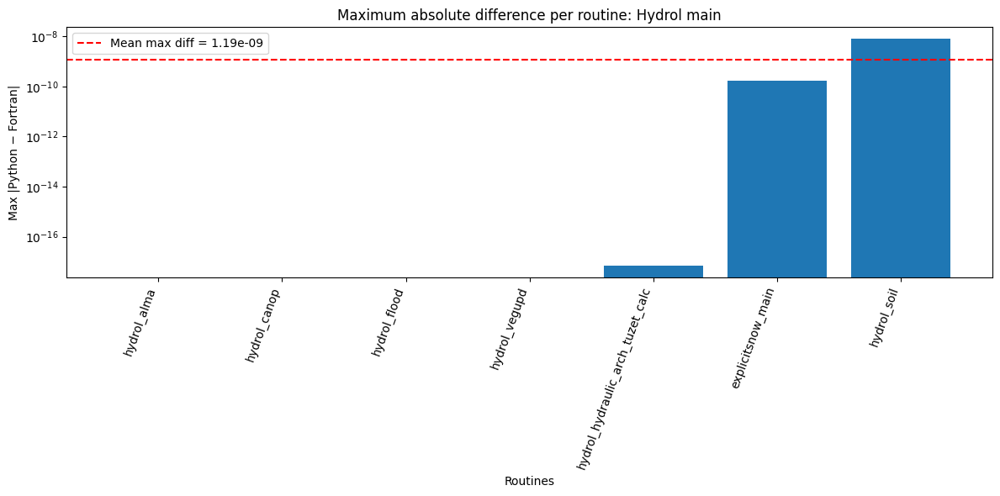

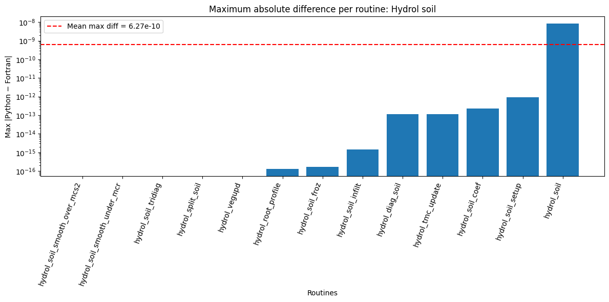

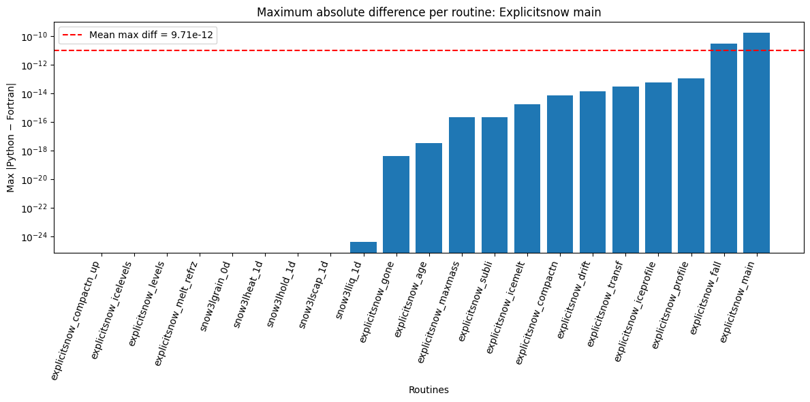

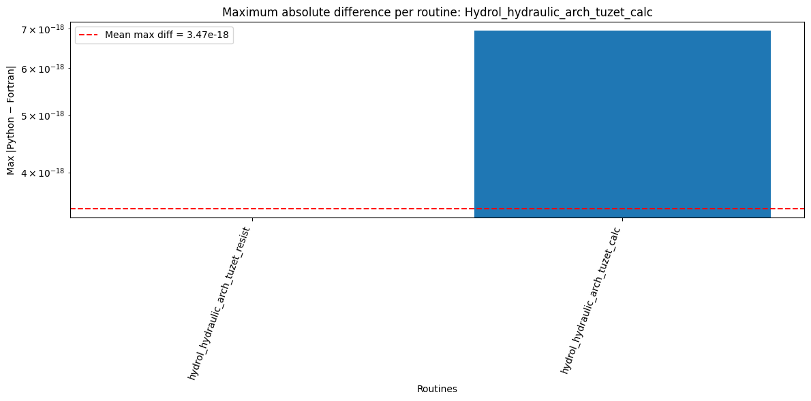

The results show that the maximum absolute difference is typically of
the order of ``10^-16``, which corresponds to the machine precision of
double-precision (64-bit) floating-point arithmetic. Such differences
are expected when comparing two independent implementations of the same
algorithm and indicate that the transpilation preserves the numerical
behavior of the original Fortran code.

Several factors contribute to these small discrepancies.

First, floating-point arithmetic is not mathematically associative.
Although two implementations may execute the same algorithm, the order
in which additions and multiplications are performed may differ slightly
between the Fortran compiler and the Python/NumPy implementation. Since
each floating-point operation introduces a small rounding error, these
differences can accumulate, resulting in tiny variations at the level of
machine precision.

Second, both implementations follow the IEEE-754 floating-point
standard, but they may employ different optimization strategies. Modern
Fortran compilers often perform instruction reordering and vectorization
optimizations, whereas NumPy delegates many operations to optimized BLAS
or LAPACK libraries:
`NumPy BLAS or LAPACK <https://superfastpython.com/what-is-blas-and-lapack-in-numpy/>`_.
These implementation details can produce slightly different rounding
behavior while remaining numerically equivalent.

Overall, the observed maximum absolute differences of approximately
``1e-16`` demonstrate that the transpilation faithfully reproduces the
behavior of the original Fortran implementation. The numerical
differences are entirely consistent with the expected rounding errors of
IEEE-754 double-precision arithmetic and are well within the tolerances
used throughout the validation process.

Performance Comparison Between JAX and Fortran
----------------------------------------------

The performance evaluation was carried out using the same benchmarking
methodology described previously. In addition to validating the
numerical consistency between the JAX and Fortran implementations, we
measured the execution time of both implementations to quantify the
performance gains achieved by the JAX conversion.

As discussed in :doc:`jax_conversion`, the conversion to JAX is not a
direct translation of the original Fortran code. Instead, it represents
a transformation and optimization phase that emphasizes vectorization
and the use of JAX intrinsic operations. These optimizations, combined
with JAX's tracing and Just-In-Time (JIT) compilation capabilities,
significantly improve the execution performance of the generated
routines.

Performance Comparison: JAX Speed-up vs. Fortran Runtime
~~~~~~~~~~~~~~~~~~~~~~~~~~~~~~~~~~~~~~~~~~~~~~~~~~~~~~~~

The following figures present the speed-up obtained by the JAX
implementation relative to the original Fortran implementation. Overall,
the JAX implementation consistently outperforms the Fortran version for
most high-level routines, demonstrating the effectiveness of the applied
optimizations and vectorization strategies.

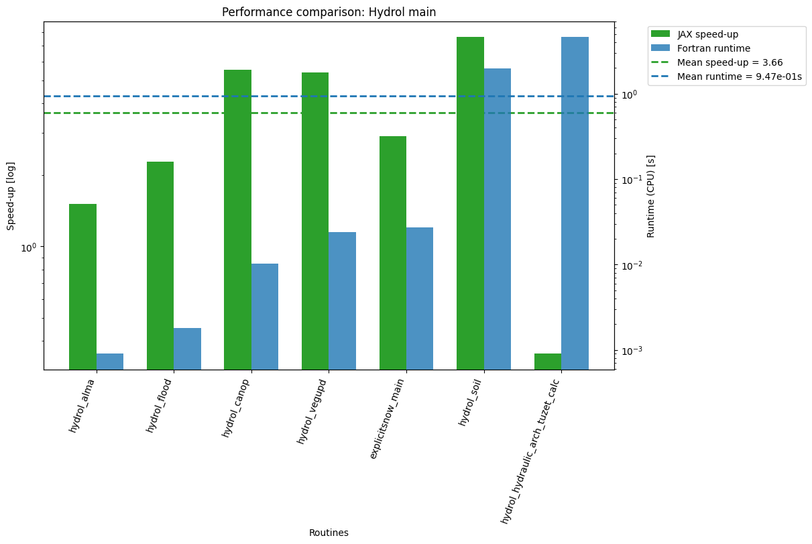

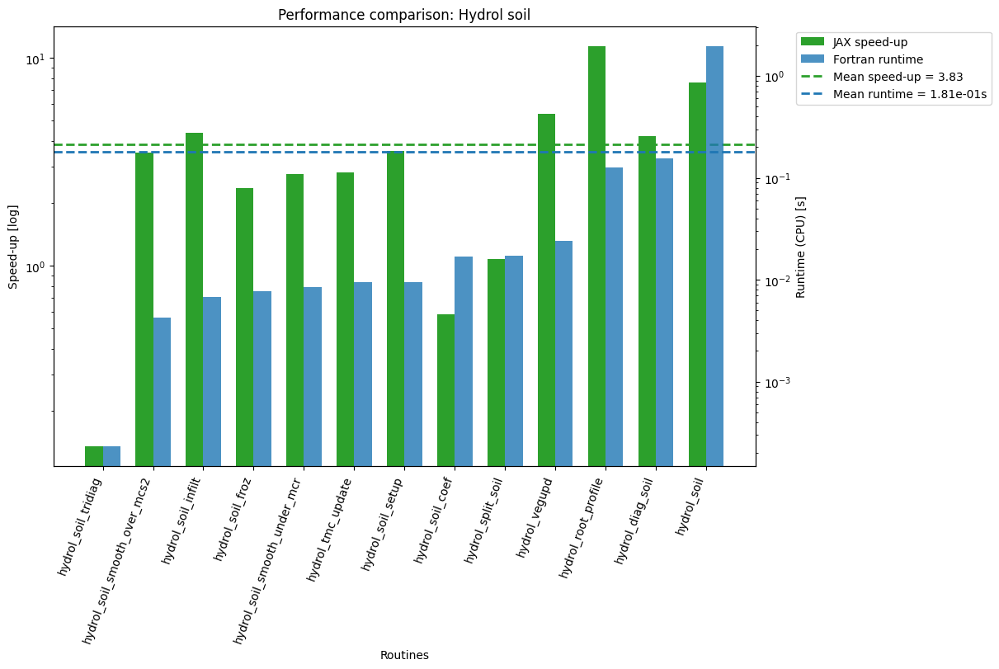

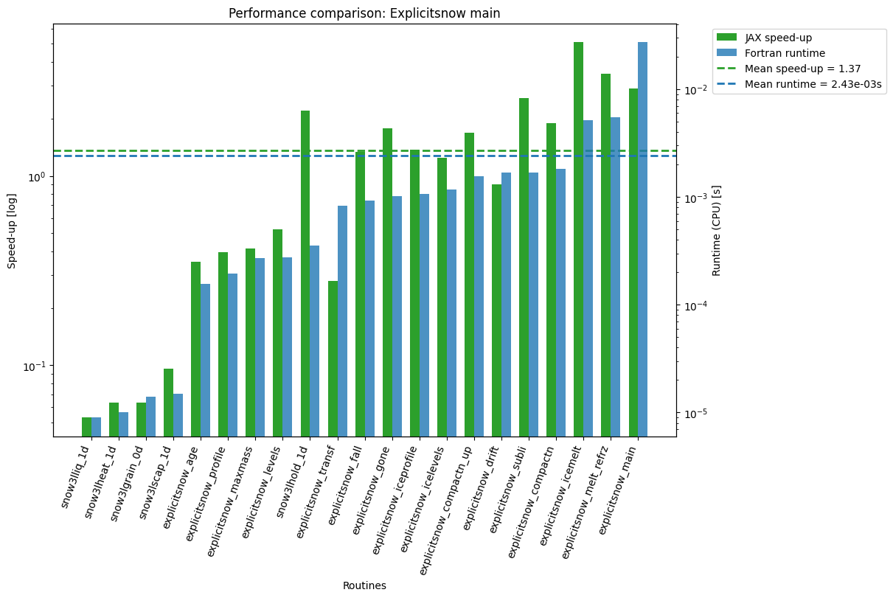

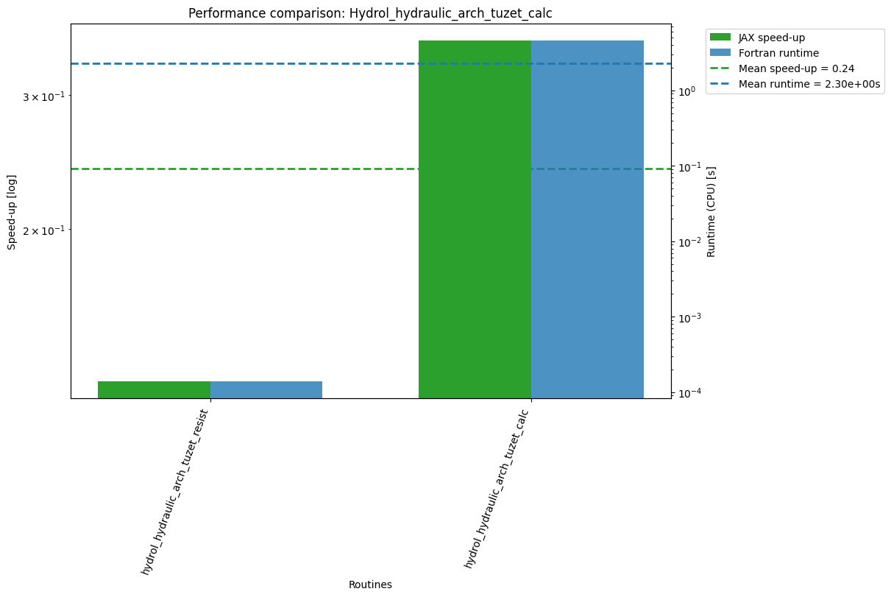

Across all evaluated high-level routines, the JAX implementation achieves
an average speed-up of **3.66×** on CPU (arithmetic mean of the
per-routine speedups shown in the table below). All modules, such as
``explicitsnow_main``, exhibit particularly strong performance, with
nearly all of their child routines executing faster than their Fortran
counterparts.

.. note::

   All reported JAX timings correspond to **post-warm-up (steady-state)**
   calls, i.e. the JIT tracing and compilation cost of the first call is
   excluded from these measurements. This reflects the typical usage
   pattern for these routines, where a given function is traced once and
   then invoked many times (e.g. across simulation timesteps), so the
   one-time compilation overhead is amortized and not representative of
   sustained performance. The compilation cost of the first call is
   therefore not included in the speed-up figures reported in this
   section.

.. note::

   The only exception is the routine
   ``hydrol_hydraulic_arch_tuzet_calc``. Its implementation consists of an
   outer dynamic loop that repeatedly invokes child routines. Since the loop
   structure cannot be effectively vectorized, JAX is unable to apply its
   usual optimization strategy, resulting in lower performance than the
   original Fortran implementation.

The table below summarizes the execution time (in seconds) of each
high-level routine on CPU.

.. list-table:: CPU Runtime Comparison
   :header-rows: 1
   :widths: 35 20 20

   * - Routine
     - JAX (CPU)
     - Fortran (CPU)
   * - ``hydrol_alma``
     - **0.000599**
     - 0.000904
   * - ``hydrol_canop``
     - **0.001840**
     - 0.010225
   * - ``hydrol_flood``
     - **0.000796**
     - 0.001814
   * - ``hydrol_vegupd``
     - **0.004448**
     - 0.023951
   * - ``hydrol_soil``
     - **0.257696**
     - 1.960143
   * - ``explicitsnow_main``
     - **0.009416**
     - 0.027354
   * - ``hydrol_hydraulic_arch_tuzet_calc``
     - 13.007017
     - **4.606041**

The following figure compares the execution performance of the original
Python, JAX, and Fortran implementations. As shown both in the figure and
in the runtime table above, JAX consistently achieves the lowest
execution time for nearly all tested routines. The only exception is
``hydrol_hydraulic_arch_tuzet_calc``, where the inability to efficiently
vectorize the routine leads to slower execution than the optimized
Fortran implementation.

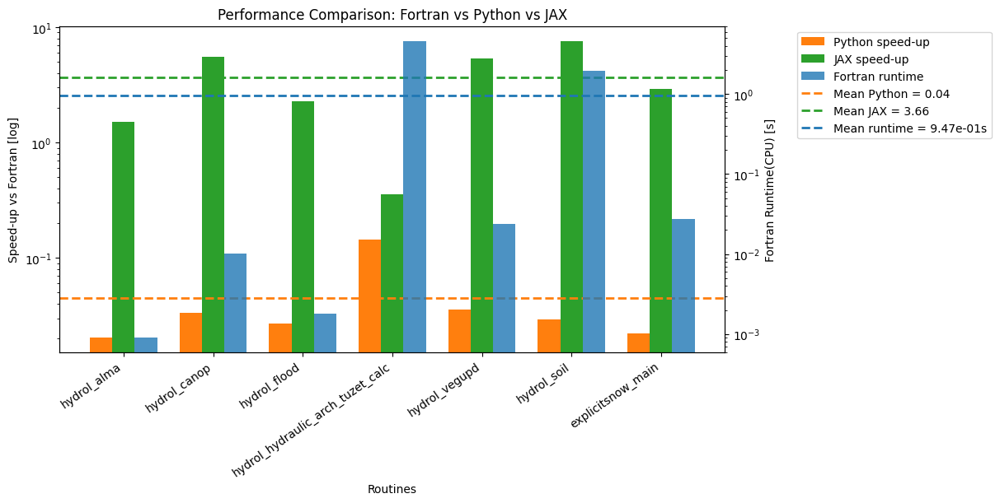

Beyond runtime performance, the numerical correctness of the JAX
implementation was evaluated the same way as for the Python version: by
computing the maximum absolute difference between the values produced by
the JAX and Fortran implementations for every tested variable in each
isolated routine. The following figures summarize these results.

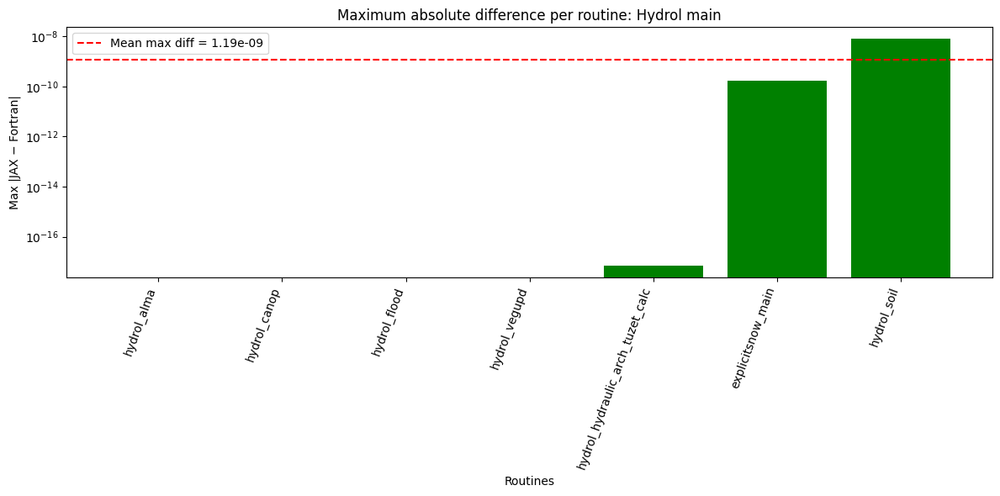

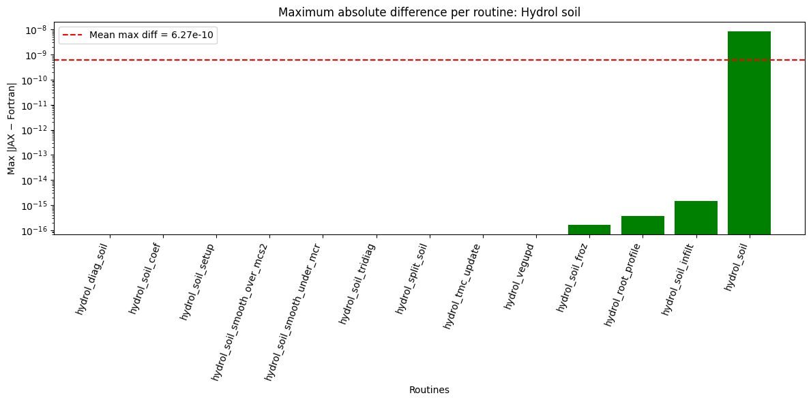

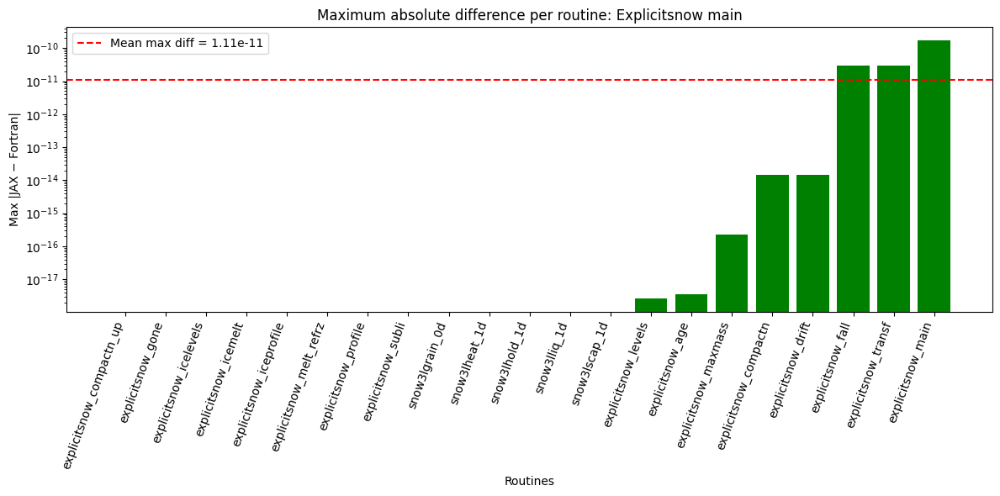

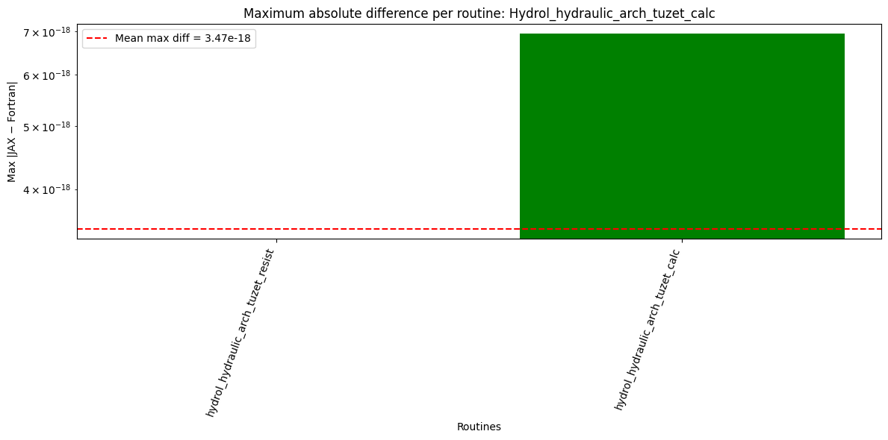

As with the Python comparison, most routines fall into one of three
groups: an exact match (no bar, since a zero difference cannot be
represented on a logarithmic axis), a machine-epsilon-level difference on
the order of ``1e-16``, or a somewhat larger — but still negligible —
difference on the order of ``1e-11`` to ``1e-10`` for the highest-level,
most composite routines (e.g. ``explicitsnow_main``, ``explicitsnow_fall``,
``explicitsnow_transf``), where per-child rounding differences accumulate
along the call chain. All observed differences remain many orders of
magnitude below the validation tolerances (``rtol=1e-5``, ``atol=1e-8``)
used throughout this pipeline.

Comparing Python and JAX Numerical Differences
~~~~~~~~~~~~~~~~~~~~~~~~~~~~~~~~~~~~~~~~~~~~~~

Although the Python and JAX implementations are generated from the same
intermediate representation, they do not produce identical numerical
differences relative to the Fortran reference. This is expected: each
backend executes the same mathematical operations through a different
execution stack, so rounding errors accumulate independently.

- The mean maximum differences are nearly identical (Python:
  ``9.71e-12``; JAX: ``1.11e-11``), indicating that both backends agree
  with the Fortran reference to essentially the same floating-point
  precision.
- The Python implementation executes through NumPy, whereas the JAX
  implementation is lowered through XLA. XLA may fuse, reorder, or
  vectorize operations (particularly when the ``vectorize`` parameter is
  enabled; see :doc:`jax_conversion`), resulting in a different sequence
  of floating-point operations and therefore different rounding behavior.
- The largest differences occur in the same high-level composite
  routines (for example, ``explicitsnow_main`` and its immediate
  callees), indicating that the dominant source of numerical drift is
  accumulation through the call hierarchy rather than backend-specific
  behavior.
- The two backends do not always agree on which routines match the
  Fortran reference exactly. A routine that is bit-identical to Fortran
  in one backend may differ by a few units in the last place in the
  other, simply because the operation ordering differs. Exact agreement
  is therefore incidental and should not be interpreted as one backend
  being more numerically accurate than the other.

Overall, both backends preserve the numerical behavior of the original
Fortran implementation well within tolerance, and the modest differences
between the two are attributable to the different arithmetic scheduling
strategies of NumPy/BLAS versus XLA, rather than to any loss of
correctness introduced by the transpilation or JAX conversion process.

Environment and Reproducibility
-------------------------------

To allow these results to be reproduced or compared against, this section
summarizes the build configuration and hardware used for the Fortran
reference implementation.

**Fortran compiler and build flags**

The original ORCHIDEE ``hydrol_main`` workflow is compiled with the
NVIDIA HPC Fortran compiler through an MPI wrapper:

- Compiler: ``mpif90`` (NVIDIA HPC SDK Fortran compiler, ``nvfortran``
  backend)
- CPU build flags: ``-Wall -g -O0 -Kieee -Ktrap=fp -Mbounds -traceback
  -r8 -i4``
- GPU build flags (OpenACC, not used for the benchmarks in this section):
  ``-Wall -g -O0 -Kieee -Ktrap=fp -Mbounds -traceback -r8 -i4 -acc
  -gpu=cc80``

.. note::

   The benchmark build uses ``-O0`` (no compiler optimization), plus
   ``-Kieee`` (strict IEEE-754 arithmetic) and ``-Ktrap=fp`` (floating-point
   trapping) for debugging and numerical-consistency purposes. This is
   **not** an optimized production build. Runtimes measured against a
   ``-O2``/``-O3`` optimized Fortran build would be expected to be
   noticeably faster, and the reported Python/JAX speed-ups in this
   document should be interpreted with that in mind.

- Libraries linked: NetCDF (C/Fortran), IOIPSL, XIOS, ORCHIDEE
- Default types: ``REAL(KIND=8)`` (via ``-r8``) / 32-bit integers (via
  ``-i4``)

**Hardware**

- CPU model: *AMD EPYC 7302 16-Core Processor*
- Core count used: *64*
- Memory: *6GiB*

**Software versions**

- NVIDIA HPC SDK / ``nvfortran`` version: *21.9-0*
- Python version: *3.10.20*
- NumPy version: *2.2.6*
- JAX version: *0.6.2*
