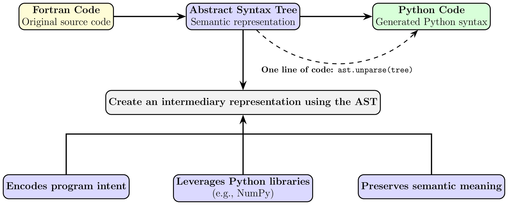

Overview
========

FGPT (Fortran General-Purpose Transpiler) is a Python-based framework for analyzing,
transforming, and converting Fortran code into modern Python ecosystems such as NumPy and JAX.
It is designed to support scientific code modernization, GPU adaptation, and AST-level program
transformation.

What is FGPT?
-------------

FGPT provides a modular, compiler-style pipeline (frontend → middle-end → backend; see
:doc:`architecture`) for:

- **Fortran code parsing**: Build AST representations using fparser-based tooling
- **Subroutine isolation**: Extract a self-contained target subroutine and its
  cross-module dependencies from a large codebase
- **Dependency extraction**: Identify subroutines, variables, loops, and call graphs
- **Shape inference**: Resolve implicit array shapes across call chains
- **Code transformation**: Convert Fortran constructs into Python/NumPy-compatible code
- **AST rewriting utilities**: Modify structure for vectorization and optimization
- **JAX conversion support**: Enable GPU-ready, optimizing transformations for scientific workloads

Problem Statement
-----------------

Scientific Fortran codes are widely used in climate and numerical modeling, but they present
significant challenges for modern computing environments:

- Lack of native GPU support
- Hard-to-maintain legacy code structures
- Implicit typing and array shapes
- Complex inter-subroutine dependencies
- Limited interoperability with Python ecosystems

These limitations make it difficult to:

- Accelerate simulations on GPUs
- Integrate with modern ML workflows
- Perform large-scale code refactoring safely

Solution Approach
-----------------

FGPT addresses these challenges through a structured, three-phase transformation pipeline.

**Input:**

- Fortran source code (.f, .f90, modules, subroutines)
- Parsed AST using fparser

**Frontend — parsing and IR construction:**

- Fortran parsing and AST generation (Processor)
- Target subroutine isolation and cross-module dependency resolution (Isolator, Navigator)
- Structural analysis and metadata extraction, including array-shape inference (Extractor, Shaper)
- Optional AST-level rewriting for vectorization and GPU adaptation (Modifier)

**Middle-end — transpiling to NumPy:**

- Statement/expression-level Fortran → NumPy translation, including intrinsic function
  normalization (F2NP, Intrinsic module)
- Class-level assembly of the translated module (Transformer)

   **Figure 2:** Overview of the Fortran-to-Python translation workflow.
   The original Fortran source code is first converted into an Abstract Syntax Tree (AST),
   which serves as an intermediary semantic representation before generating equivalent Python code.
   The AST preserves program intent and semantic meaning while enabling the use of Python
   libraries such as NumPy. Although Python code can be produced directly via ast.unparse(tree),
   the intermediary AST provides a structured foundation for reliable translation.

**Backend — transforming to JAX:**

- Class-level restructuring into an Equinox module (AutoDiff)
- Optimizing, analysis-driven control-flow and expression rewriting for XLA tracing
  (JaxConverter)

Architecture Overview
----------------------

.. code-block:: text

    Fortran Source                Frontend                  Middle-End              Backend
    ───────────────   ───────────────────────────────   ─────────────────   ─────────────────────
       .f / .f90   →  Processor → Isolator → Navigator   →   F2NP           →   AutoDiff
                       → Extractor (+ Shaper) → Modifier →   → Transformer  →   → JaxConverter
                                                              (NumPy output)     (JAX/Equinox output)

See :doc:`architecture` for the full class-by-class breakdown of each phase.

Key Components
--------------

**Frontend**

1. **Processor**
   Parses Fortran source files and builds the fparser-based AST used throughout the frontend.
2. **Isolator**
   Entry point of the pipeline. Identifies the target module/subroutine and drives parsing,
   producing the AST that downstream frontend components operate on.
3. **Navigator**
   Resolves cross-file dependencies and subroutine call relationships by following ``USE`` chains.
4. **Extractor**
   Identifies subroutines, variables, loops, and dependency structures via static analysis.
   Delegates array-shape and dimension inference to the **Shaper**.
5. **Modifier**
   Optional AST-level rewriting pass for vectorization, GPU adaptation, and other
   non-portable-construct fixes, applied before transpiling begins.

**Middle-end**

6. **Intrinsic System**
   Normalizes Fortran intrinsic functions (``SUM``, ``MAXVAL``, ``RESHAPE``, etc.)
   into their NumPy equivalents; used by F2NP during translation.
7. **F2NP**
   Performs statement- and expression-level translation of the Fortran AST into a raw
   Python AST.
8. **Transformer**
   Assembles F2NP's output into a proper Python class (attributes, method calls, I/O
   boilerplate) and emits the final NumPy-based ``.py`` file.

**Backend**

9. **AutoDiff**
   Restructures the NumPy class into an ``eqx.Module`` (class-level orchestration),
   analogous to Transformer's role in the middle-end.
10. **JaxConverter**
    Specialized, analysis-driven pipeline that rewrites control flow and expressions
    (loops, conditionals, array updates) into JAX-traceable, GPU/TPU-executable code.

Performance Highlights
----------------------

- **Code coverage**: Supports complex multi-module Fortran scientific codes
- **Transformation depth**: Multi-level AST rewriting across call chains
- **GPU readiness**: Enables JAX-compatible output for accelerator execution
- **Extensibility**: Modular design for adding new transformations
- **Scalability**: Handles large climate and numerical modeling codebases

Next Steps
----------

- :doc:`installation` - Set up FGPT environment
- :doc:`quickstart` - Run your first Fortran-to-Python conversion
- :doc:`jax_conversion` - Learn JAX conversion for optimized and accelerated code
