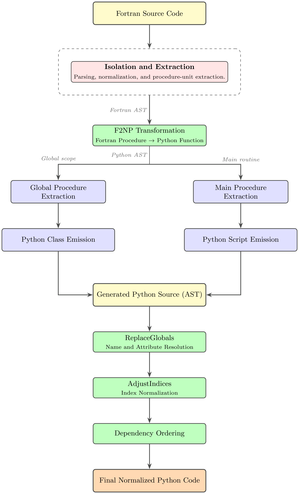

Fortran-to-Python Transpilation
================================

This section documents the Fortran-to-Python transpilation pipeline,
which performs source-to-source translation of production Fortran
subroutines into executable NumPy-based Python code. Each Fortran
construct — declarations, control flow, array operations, intrinsic
functions — is translated to a structurally equivalent Python
counterpart, preserving the original numerical semantics.

The pipeline is composed of several cooperating classes that handle
parsing, static analysis, isolation, optional code correction, and
statement-level translation.

.. contents:: Contents
   :local:
   :depth: 2

Overview
--------

The pipeline proceeds in three broad phases:

1. **Preprocessing** — The target Fortran subroutine is located, parsed,
   and structurally analysed. :class:`~fgpt.core.frontend.processor.Processor`
   provides the underlying ``fparser``-based AST construction used
   throughout. :class:`~fgpt.isolator.Isolator` extracts a single
   subroutine from the wider codebase so that it can be transpiled
   independently. :class:`~fgpt.core.frontend.navigator.Navigator` resolves
   cross-module variable and subroutine references via breadth-first
   search, supplying the :class:`~fgpt.core.frontend.extractor.Extractor`
   with the complete symbol information it needs.
   :class:`~fgpt.core.frontend.extractor.Extractor` performs static
   analysis to build the metadata structures (array shapes, loop patterns,
   dependency graphs, scope information) consumed by the transpilation
   stage. Array shape/dimension resolution specifically is delegated to
   :mod:`~fgpt.core.analysis.shaper`.

2. **Optional Fortran-level correction**
   (:class:`~fgpt.core.passes.modifier.Modifier`) — Before transpilation,
   the isolated Fortran AST may be rewritten to remove non-portable
   constructs, restructure loops for vectorisation, or prepare GPU-oriented
   patterns. This pass operates entirely within the Fortran AST and
   produces no Python output of its own. For GPU/OpenACC-targeted
   isolation specifically, see :mod:`~fgpt.gpu_isolator` rather than the
   general-purpose :class:`~fgpt.isolator.Isolator`.

3. **Transpilation** (:class:`~fgpt.core.transpiler.f2np.F2NP` +
   :class:`~fgpt.core.transpiler.transformer.Transformer`) — The
   statement-level translator walks the (possibly modified) Fortran AST
   subroutine by subroutine and emits a raw Python :mod:`ast` tree,
   statement by statement and expression by expression. Intrinsic function
   mapping (``ABS``, ``SQRT``, ``MAXVAL``, …) is handled by the lookup
   table in :mod:`~fgpt.core.transpiler.intrinsic`. The pipeline orchestrator
   then wraps this raw AST in a Python class structure, resolves
   inter-subroutine dependencies, generates binary I/O helpers, and emits
   the final ``.py`` source file.

Two :class:`ast.NodeTransformer` passes are applied after the initial
translation to correct the raw output before it is written to disk:

- ``ReplaceGlobals`` rewrites unqualified variable and method references —
  emitted verbatim by :class:`~fgpt.core.transpiler.f2np.F2NP` from Fortran
  names — into ``self.attr`` or ``instance.attr`` accesses appropriate for
  the generated Python class.
- ``AdjustIndices`` compensates for Fortran's 1-based array indexing by
  inserting ``- 1`` offsets at every array subscript and adjusting loop
  bounds correspondingly, since Python arrays are 0-based.

.. note::
   **Path correction pending verification.** The previous revision of this
   document located these two classes at ``fgpt.utils``, which does not
   exist in the current tree. The current source layout has no single
   obvious home for them — the closest candidates are
   :mod:`~fgpt.core.transpiler.transformer` (same package as their caller)
   or :mod:`~fgpt.core.common.utils` (general shared helpers). Please
   confirm the actual defining module and update the ``:class:`` targets
   above accordingly; they are left unlinked here rather than guessed.

Pipeline Diagram
~~~~~~~~~~~~~~~~

.. code-block:: text

        Fortran source (.f90)
                │
                ▼
        ┌──────────────────────────────┐
        │ core.frontend.processor      │  parses Fortran source into an fparser AST
        │   Processor                  │
        └───────┬──────────────────────┘
                │
                ▼
        ┌──────────────────────────────┐
        │ isolator.Isolator            │  extracts a single subroutine for standalone transpilation
        └───────┬──────────────────────┘
                │
        ┌───────┴───────┐
        │               │
        ▼               ▼
  core.frontend      core.frontend
  .navigator         .extractor
  Navigator          Extractor  ──uses──▶ core.analysis.shaper
  (cross-module      (static analysis:      (array shape/dim analysis)
   symbol search)     arrays, loops,
        │              scope, deps)
        └───────┬───────┘
                │  metadata
                ▼
        ┌──────────────────────────────┐
        │ core.passes.modifier         │  optional Fortran-level rewrites (portability / GPU / vectorisation)
        │   Modifier                   │
        └───────┬──────────────────────┘
                │  corrected Fortran AST
                ▼
        ┌────────────────────────────────┐
        │ core.transpiler.f2np           │  source-to-source: Fortran statements & expressions → Python AST
        │   F2NP  ──uses──▶ core.transpiler.intrinsic (Fortran → NumPy mapping)
        └───────┬────────────────────────┘
                │  raw Python AST
                ▼
        ┌──────────────────────────────┐
        │ core.transpiler.transformer    │  class scaffolding, dependency resolution, I/O, output
        │   Transformer                │
        └───────┬──────────────────────┘
                │
      ┌─────────┴─────────┐
      │                   │
      ▼                   ▼
  ReplaceGlobals      AdjustIndices
  (name rewrites)     (1-based → 0-based index offsets)
  [module TBD — see note above]
      └─────────┬─────────┘
                │
                ▼
        Python source (.py)

Fortran Parser
--------------

:class:`~fgpt.core.frontend.processor.Processor` is the shared parsing
primitive used throughout the pipeline. It wraps ``fparser`` with a
Fortran 2008 grammar to build ASTs from files, strings, or individual
statements, and exposes utilities for code generation, transformation, and
structural analysis. It also manages workspace directories for
benchmarking and intermediate outputs.

The class is designed to be lightweight and reusable across all pipeline
stages and is used internally by :class:`~fgpt.isolator.Isolator`,
:class:`~fgpt.core.frontend.navigator.Navigator`, and
:class:`~fgpt.core.frontend.extractor.Extractor`.

Subroutine Isolator
-------------------

:class:`~fgpt.isolator.Isolator` extracts and prepares a target Fortran
subroutine or function so that it can be transpiled independently of the
wider codebase. This is the first structural step in the pipeline and
serves three purposes:

- Isolated testing or debugging of specific Fortran routines before
  transpilation.
- Providing a self-contained input to the source-to-source translation
  stage.
- Generating standalone reproducible test cases from large codebases.

The class locates and loads the specified Fortran module, parses it into
an AST via :class:`~fgpt.core.frontend.processor.Processor`, stores both
the original and a re-parsed copy for structural transformation, and
prepares metadata about internal subroutine calls and dependency flags
used by downstream passes.

.. note::
   :mod:`~fgpt.gpu_isolator` provides an analogous isolation pipeline
   specialised for GPU/OpenACC targets and is not covered by this class;
   see that module's documentation for isolation of GPU-oriented
   subroutines.

Cross-Module Navigator
----------------------

:class:`~fgpt.core.frontend.navigator.Navigator` resolves variable
declarations and subroutine definitions that are not present in the
immediately parsed module. It performs a breadth-first search over the
module hierarchy, following ``USE`` chains across file boundaries,
handling external subroutine interface blocks and avoiding redundant
traversal via a visited-modules set.

The Navigator is called exclusively by
:class:`~fgpt.core.frontend.extractor.Extractor` whenever a symbol cannot
be resolved within the current module scope. Its output feeds directly
into the metadata structures the Extractor builds for the transpilation
stage.

Static Analysis Engine
----------------------

:class:`~fgpt.core.frontend.extractor.Extractor` performs static and
structural analysis of the parsed Fortran module and builds all metadata
structures required for accurate source-to-source translation. It
operates on the AST produced by
:class:`~fgpt.core.frontend.processor.Processor`, uses
:class:`~fgpt.core.frontend.navigator.Navigator` for cross-module symbol
resolution, and produces metadata consumed by both
:class:`~fgpt.core.transpiler.f2np.F2NP` and
:class:`~fgpt.core.transpiler.transformer.Transformer`.

Core responsibilities include:

- Detecting and indexing subroutines across modules.
- Extracting dummy arguments, call graphs, and dependency structures.
- Classifying scalar, array, and modified variables.
- Tracking loop structures and vectorised patterns.
- Resolving global vs. local variable scope.
- Building implicit array shape information, via
  :mod:`~fgpt.core.analysis.shaper`.

The Extractor is stateful and builds progressively richer metadata as
analysis proceeds. It should be re-instantiated per independent
transpilation session.

Array Shape Analysis
---------------------

:mod:`~fgpt.core.analysis.shaper` provides dedicated array shape and
dimension analysis, factored out of the Extractor into its own module. It
is invoked by :class:`~fgpt.core.frontend.extractor.Extractor` while
building metadata, and its results are also consulted by
:class:`~fgpt.core.passes.modifier.Modifier` when resolving implicit array
shapes during Fortran-level rewriting.

Fortran Code Modifier
---------------------

:class:`~fgpt.core.passes.modifier.Modifier` is an optional pass that
rewrites the Fortran AST *before* transpilation begins. It operates
entirely within the Fortran representation and produces no Python
output — its purpose is to normalise the source so that
:class:`~fgpt.core.transpiler.f2np.F2NP` encounters only constructs it can
translate directly.

Key responsibilities include:

- Rewriting unsupported or non-portable Fortran constructs into
  translatable equivalents.
- Transforming array operations and resolving implicit array shapes (via
  :mod:`~fgpt.core.analysis.shaper`).
- Restructuring loops for vectorisation and inserting vector loop
  patterns.
- Normalising conditional structures (``IF`` / ``ELSE IF`` / ``ELSE``).
- Adapting subroutine call patterns for the target translation.
- Preparing GPU-oriented memory movement patterns for OpenACC targets.

The Modifier assumes prior parsing by
:class:`~fgpt.core.frontend.processor.Processor` and metadata extraction
by :class:`~fgpt.core.frontend.extractor.Extractor`. It should not be
reused across unrelated transpilation sessions without reinitialization.

Statement-Level Translator
--------------------------

:class:`~fgpt.core.transpiler.f2np.F2NP` is the core of the transpiler. It
performs the actual source-to-source translation, walking the Fortran AST
for a single subroutine or function and incrementally building the
equivalent Python :mod:`ast` tree, statement by statement and expression
by expression.

Where :class:`~fgpt.core.transpiler.transformer.Transformer` works at the
level of the whole program (declarations, class structure, file I/O),
F2NP operates at the granularity of individual Fortran statements and
expressions, mapping each construct to its Python/NumPy equivalent:

- Fortran ``DO`` loops → Python ``for`` loops over ``range``.
- Fortran ``IF`` / ``ELSE IF`` / ``ELSE`` → Python ``if`` / ``elif`` /
  ``else`` chains.
- Fortran ``WHERE`` constructs → ``if mask.any(): ...`` blocks with
  boolean-mask subscripting on the left-hand side.
- Fortran ``SELECT CASE`` → Python ``if`` / ``elif`` chains.
- Fortran intrinsic functions (``ABS``, ``SQRT``, ``MAXVAL``, …) → their
  NumPy equivalents via the mapping table in
  :mod:`~fgpt.core.transpiler.intrinsic`.
- Fortran array part references → Python subscript expressions, with
  ambiguous references (array vs. function call) resolved using metadata
  from :class:`~fgpt.core.frontend.extractor.Extractor`.

Control-flow constructs are tracked via an explicit stack and
per-construct counters rather than Python's call stack, since Fortran's
block-closing statements (``END IF``, ``END DO``, ``END SELECT``) must be
matched against possibly nested and chained (``ELSE IF``) constructs.

The main entry point is
:meth:`~fgpt.core.transpiler.f2np.F2NP.recursive_ast`, which dispatches each
Fortran statement type to a dedicated ``handle_*`` method.
Expression-level translation is centralised in
:meth:`~fgpt.core.transpiler.f2np.F2NP.handle_expr`, which delegates to
specialised handlers for array part references, intrinsic functions
(via :mod:`~fgpt.core.transpiler.intrinsic`), level-4 relational
expressions, logical operators, and real literal constants.

An :class:`~fgpt.core.frontend.extractor.Extractor` instance may be
supplied to disambiguate constructs such as array references vs. function
calls. If omitted, the translator falls back to conservative defaults
(treating ambiguous references as array accesses).

See the :doc:`API reference </api/fgpt>` for the full signature and
behaviour of each handler.

Intrinsic Function Mapping
----------------------------

:mod:`~fgpt.core.transpiler.intrinsic` holds the lookup table mapping
Fortran intrinsic functions (``ABS``, ``SQRT``, ``MAXVAL``, and similar)
to their NumPy equivalents. It is consulted by
:class:`~fgpt.core.transpiler.f2np.F2NP` during expression-level
translation and is factored out as its own module so the mapping can be
extended independently of the statement-translation logic.

Pipeline Orchestrator
---------------------

:class:`~fgpt.core.transpiler.transformer.Transformer` is the transpilation
counterpart to a compiler's back-end: it takes the raw Python AST nodes
emitted by :class:`~fgpt.core.transpiler.f2np.F2NP` and assembles them into
a coherent, importable Python module. It handles everything above the
statement level.

**Class scaffolding.** Fortran ``SPECIFICATION PART`` declarations are
converted into Python class attributes and ``__init__`` assignments.
Dependent variables are located via a recursive search and
pre-initialised before the translated methods reference them, ensuring
the generated class is self-consistent.

**Dependency resolution.** Before any transpilation can occur, the
Transformer builds ``cls_info`` — a mapping of variable names to their
owning class — by interrogating the Fortran declarations and resolving
``USE`` statement imports. This metadata is later consumed by
``ReplaceGlobals`` and the call-site rewriting passes.

**Call-site rewriting.** Fortran ``CALL`` statements are rewritten as
method invocations on the appropriate Python class instance. This
involves resolving which class owns the callee, injecting the correct
``self`` or instance argument, and correcting any argument-order
mismatches introduced by the translation.

**Binary I/O generation.** For subroutines that read binary Fortran data
files, the Transformer synthesises the corresponding NumPy binary-read
boilerplate and inserts it into both the global class template and the
main driver script.

**Output.** Translated and post-processed AST nodes are inserted at
precise locations in the output module tree, and the final
:class:`ast.Module` is unparsed to a ``.py`` source file. A companion
test function is optionally generated to validate the transpiled
subroutine in isolation.

See the :doc:`API reference </api/fgpt>` for the full method signatures.

AST Post-Processing Transformers
---------------------------------

These two :class:`ast.NodeTransformer` subclasses are applied after the
initial source-to-source translation pass to correct systematic gaps in
the raw output that are most naturally fixed as a separate tree-walk.

.. note::
   As noted above, their defining module could not be confirmed against
   the current project tree (no ``utils.py`` under ``core/transpiler/`` is
   listed). References below are left as bare names rather than linked
   ``:class:`` targets until the correct module path is confirmed.

ReplaceGlobals
~~~~~~~~~~~~~~

**When it runs:** called by
:meth:`~fgpt.core.transpiler.transformer.Transformer.update_global_python`
and
:meth:`~fgpt.core.transpiler.transformer.Transformer.update_main_python` via
``identify_replace_all`` after all subroutine functions have been
attached to the class.

**What it fixes:** :class:`~fgpt.core.transpiler.f2np.F2NP` emits Fortran
variable names verbatim as Python ``Name`` nodes, because at translation
time the class structure does not yet exist. ``ReplaceGlobals`` performs
a second pass over the completed class AST and rewrites every name that
appears in ``cls_info`` into the appropriate ``self.attr`` or
``instance.attr`` attribute access.

.. code-block:: python

   # Before ReplaceGlobals
   def compute(self):
       temp = kjpindex * dt

   # After ReplaceGlobals (given cls_info mapping kjpindex → self)
   def compute(self):
       temp = self.kjpindex * dt

AdjustIndices
~~~~~~~~~~~~~

**When it runs:** called by
:meth:`~fgpt.core.transpiler.transformer.Transformer._adjust_function_indices`
inside
:meth:`~fgpt.core.transpiler.transformer.Transformer.correct_function` for
every transpiled subroutine.

**What it fixes:** Fortran arrays are 1-based; Python arrays are 0-based.
:class:`~fgpt.core.transpiler.f2np.F2NP` emits array subscripts and loop
bounds using the original Fortran indices, and ``AdjustIndices`` inserts
the necessary ``- 1`` offsets in a dedicated post-pass rather than inline
during translation, keeping the F2NP translation rules simpler and easier
to verify.

.. code-block:: python

   # Before AdjustIndices
   for ji in range(0, kjpindex):
       result[ji] = soil_temp[ji] + 1

   # After AdjustIndices (kjpindex declared as 1-based in Fortran)
   for ji in range(0, kjpindex):
       result[ji] = soil_temp[ji - 1] + 1

.. note::

   The Python generated by the transpiler serves as an intermediate
   representation between the original Fortran source and the final JAX
   implementation. Consequently, the transpiler favors code patterns that
   are both NumPy-compatible and amenable to automatic JAX conversion, as
   carried out by the backends under
   :mod:`~fgpt.core.backends.jax_converter` (see :doc:`jax_conversion`).

End-to-end transformation pipeline
----------------------------------

   **Figure 3:** End-to-end transformation pipeline. The Fortran frontend
   parses and normalizes the source program, extracts procedure units, and lowers them
   into Python AST representations via the F2NP transformation pass. The resulting
   Python code undergoes a second-stage AST rewriting pipeline for name resolution,
   index normalization, and dependency ordering before producing the final normalized
   Python program.

Data Flow Between Components
-----------------------------

The following table summarises which component produces and which
consumes the key intermediate artefacts:

.. list-table::
   :header-rows: 1
   :widths: 30 25 25 20

   * - Artefact
     - Produced by
     - Consumed by
     - Format
   * - Fortran AST
     - :class:`~fgpt.core.frontend.processor.Processor`
     - :class:`~fgpt.isolator.Isolator`,
       :class:`~fgpt.core.frontend.navigator.Navigator`,
       :class:`~fgpt.core.frontend.extractor.Extractor`
     - ``fparser`` AST
   * - Isolation artefacts
     - :class:`~fgpt.isolator.Isolator`
     - :class:`~fgpt.core.passes.modifier.Modifier`,
       :class:`~fgpt.core.transpiler.f2np.F2NP`
     - ``fparser`` AST + metadata dicts
   * - Extracted metadata (``cls_info``, arrays, loops, scopes)
     - :class:`~fgpt.core.frontend.extractor.Extractor` (array shapes via
       :mod:`~fgpt.core.analysis.shaper`)
     - :class:`~fgpt.core.transpiler.f2np.F2NP`, ``ReplaceGlobals``,
       :meth:`~fgpt.core.transpiler.transformer.Transformer.correct_function`
     - :class:`dict`
   * - Corrected Fortran AST
     - :class:`~fgpt.core.passes.modifier.Modifier`
     - :class:`~fgpt.core.transpiler.f2np.F2NP`
     - ``fparser`` AST
   * - Raw Python AST
     - :class:`~fgpt.core.transpiler.f2np.F2NP` (intrinsics via
       :mod:`~fgpt.core.transpiler.intrinsic`)
     - :class:`~fgpt.core.transpiler.transformer.Transformer`
     - :class:`ast.Module`
   * - Post-processed AST
     - ``ReplaceGlobals``, ``AdjustIndices``
     - :meth:`~fgpt.core.transpiler.transformer.Transformer.transfer_to_pyfile`
     - :class:`ast.Module`
   * - Python source file
     - :meth:`~fgpt.core.transpiler.transformer.Transformer.transfer_to_pyfile`
     - End user /
       :meth:`~fgpt.core.transpiler.transformer.Transformer.run_python_scripts`
     - ``.py`` file

See Also
--------

* :doc:`jax_conversion` — JAX/Equinox transformation pipeline applied to
  the transpiled Python output, implemented under
  :mod:`~fgpt.core.backends.jax_converter` and orchestrated by
  :mod:`~fgpt.autodiff`.
* :mod:`~fgpt.gpu_isolator` — GPU/OpenACC-specialised counterpart to
  :class:`~fgpt.isolator.Isolator`, not otherwise covered in this
  document.
* :doc:`architecture` — How this transpilation layer fits into the
  overall FGPT pipeline.
